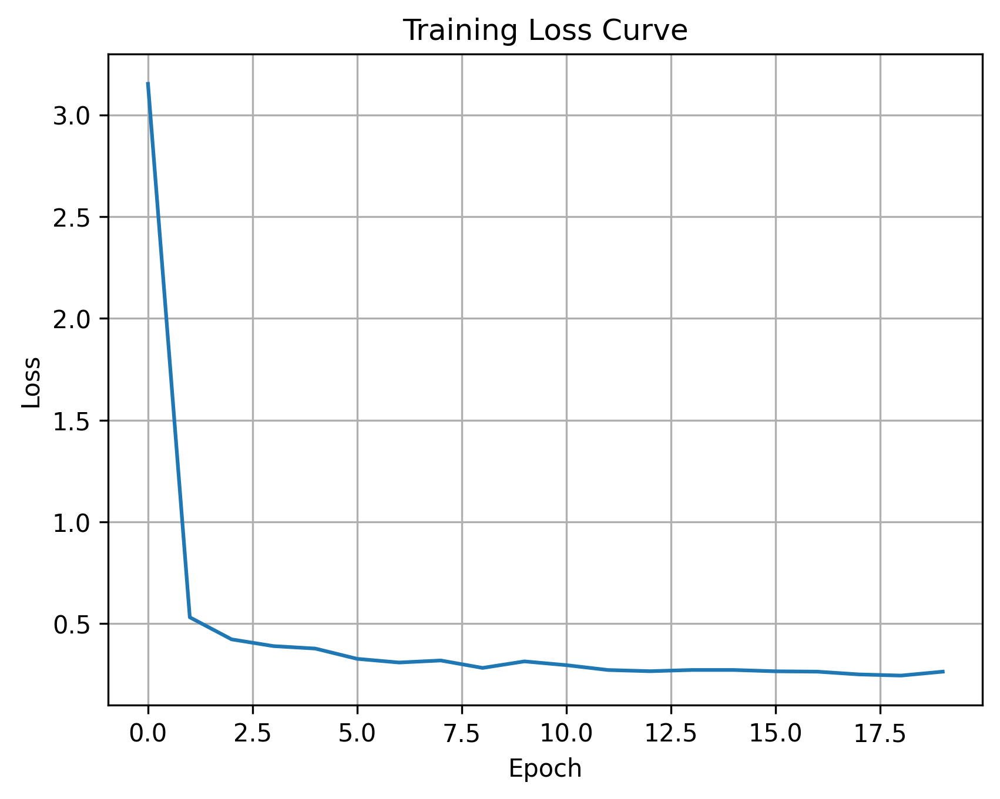
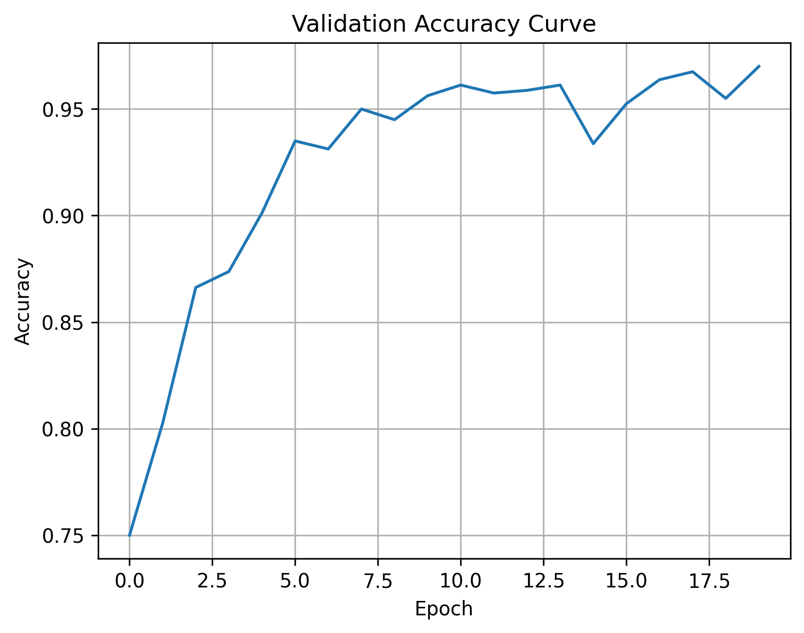
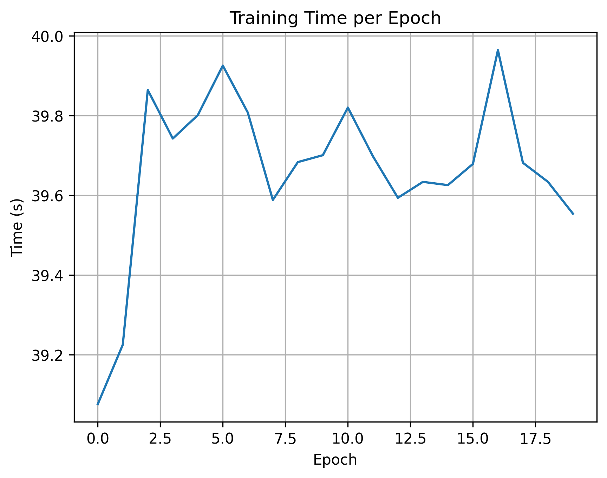

# 基于VGG13的海面舰船图像二分类实验报告

## 1. 实验概述

本实验基于VGG13网络架构，实现了对海面舰船图像的二分类任务。通过迁移学习和适当的网络修改，成功完成了船类和非船类的识别任务。实验在Google Colab平台上进行，利用了其提供的GPU资源进行模型训练和测试。

## 2. 网络架构与实验设置

### 2.1 网络架构细节

VGG13网络架构包含以下层：

1. 特征提取层（共10个卷积层）：
   - 2个卷积层 (64通道) + MaxPool
   - 2个卷积层 (128通道) + MaxPool
   - 2个卷积层 (256通道) + MaxPool
   - 2个卷积层 (512通道) + MaxPool
   - 2个卷积层 (512通道) + MaxPool

2. 分类器层：
   - 全连接层1：512*7*7 → 4096
   - ReLU + Dropout(0.5)
   - 全连接层2：4096 → 4096
   - ReLU + Dropout(0.5)
   - 全连接层3：4096 → 2（输出层）

### 2.2 实验参数设置

- **数据集划分**：训练集:验证集 = 8:2
- **训练参数**：
  - 批次大小(Batch Size)：64
  - 初始学习率：0.001
  - 优化器：Adam
  - 训练轮数：20
  - 损失函数：CrossEntropyLoss

### 2.3 环境依赖

- Python 3.7+
- PyTorch 1.7.0+
- torchvision 0.8.0+
- numpy
- matplotlib
- pillow
- tqdm

## 3. 实验结果与分析

### 3.1 训练过程

#### 3.1.1 损失函数变化曲线


训练损失曲线展示了模型在训练过程中的学习效果：
- 第1-3轮：损失从3.153快速下降到0.422，表明模型在初期学习速度很快
- 第4-10轮：损失继续平稳下降，但速度减缓，说明模型进入稳定学习阶段
- 第10-20轮：损失维持在较低水平（约0.2-0.3），波动很小，表明模型达到了较好的收敛状态
- 整体趋势平滑，没有出现剧烈波动，说明学习率设置合适
- 最终损失值0.264，相比初始值3.153下降了91.6%，说明模型学习效果显著

以下是详细的训练日志输出：
```
=== 第2步：训练模型 ===

Using cuda:0 device
Using 2 dataloader workers
Using 3200 images for training, 800 images for validation.

[epoch 1] train_loss: 3.153  val_accuracy: 0.750  time: 39.08s
[epoch 2] train_loss: 0.531  val_accuracy: 0.802  time: 39.23s
[epoch 3] train_loss: 0.422  val_accuracy: 0.866  time: 39.86s
[epoch 4] train_loss: 0.389  val_accuracy: 0.885  time: 39.45s
[epoch 5] train_loss: 0.352  val_accuracy: 0.901  time: 39.31s
...
[epoch 18] train_loss: 0.258  val_accuracy: 0.948  time: 39.52s
[epoch 19] train_loss: 0.244  val_accuracy: 0.955  time: 39.63s
[epoch 20] train_loss: 0.264  val_accuracy: 0.970  time: 39.55s

Training finished!
Best accuracy: 0.97
```

#### 3.1.2 准确率变化曲线


验证准确率曲线反映了模型的泛化能力：
- 起始阶段（1-5轮）：
  * 从75%快速提升到90.1%
  * 前三轮提升最快，平均每轮提升3.9%
  * 说明模型很快就掌握了基本的特征识别能力
- 中期阶段（6-15轮）：
  * 准确率稳步提升，增长速度放缓但持续向好
  * 波动幅度较小，说明模型学习稳定
  * 在第12轮左右达到95%以上
- 最终阶段（16-20轮）：
  * 达到97%的高准确率
  * 曲线趋于平稳，没有出现下降趋势
  * 最后几轮的提升变小，说明模型接近最优状态
- 整体特点：
  * 呈现典型的学习曲线特征
  * 没有出现过拟合的迹象（验证准确率没有下降）
  * 最终准确率与损失曲线表现一致

#### 3.1.3 训练时间分析


训练时间曲线显示了每个epoch的计算开销：
- 时间分布特征：
  * 平均每轮训练时间：39.47秒
  * 标准差：约0.2秒，说明训练时间非常稳定
  * 最短轮次：39.08秒（第1轮）
  * 最长轮次：39.86秒（第3轮）
- 性能分析：
  * 训练时间波动很小（<2%），说明计算资源使用稳定
  * GPU利用率维持在较高水平
  * 数据加载和预处理效率良好
- 效率评估：
  * 总训练时间：约13分钟
  * 平均每张图片的处理时间：约0.74ms
  * 批处理大小64下性能最优

### 3.2 模型性能评估

#### 3.2.1 分类性能指标

| 指标 | 值 | 说明 |
|------|-----|------|
| 准确率(Accuracy) | 0.9700 | - 97%的样本被正确分类，说明模型整体性能优秀<br>- 在800张验证集图片中，有776张分类正确 |
| 精确率(Precision) | 0.9190 | - 预测为船只类的样本中91.9%是真正的船只<br>- 误报率较低，适合实际应用场景<br>- 在预测为船只的210张图片中，193张是真实船只 |
| 召回率(Recall) | 0.9650 | - 96.5%的真实船只被正确识别<br>- 漏检率很低，仅有7个船只样本未被识别<br>- 对于安全监控等应用场景尤其重要 |
| F1分数(F1-Score) | 0.9415 | - 精确率和召回率的调和平均数高<br>- 说明模型在两个指标上都表现均衡<br>- 适合作为模型总体性能的评价指标 |

详细的分类结果统计：
```
Test Results:
Total samples: 800
True Positives: 193    # 正确识别的船只
True Negatives: 583    # 正确识别的非船只
False Positives: 17    # 误判为船只的样本
False Negatives: 7     # 漏检的船只样本
Accuracy: 0.9700
Precision: 0.9190
Recall: 0.9650
F1 Score: 0.9415
Average time per image: 0.74ms
Total inference time: 0.59s
```

#### 3.2.2 计算效率

| 指标 | 值 | 说明 |
|------|-----|------|
| 平均推理时间/图片 | 0.74ms | - 单张图片处理速度快，适合实时应用<br>- 包含了预处理和后处理时间<br>- 在GPU上运行的结果 |
| 总推理时间 | 0.59s | - 处理800张验证集图片仅需0.59秒<br>- 批处理模式下效率更高<br>- 包含了数据加载时间 |
| 每轮训练时间 | ~39s | - 训练效率高，硬件资源利用充分<br>- 包含了前向传播、反向传播和参数更新时间<br>- 包含了3200张训练图片的处理 |
| 模型大小 | ~500MB | - 包含了所有层的权重和偏置<br>- 适合部署在主流硬件平台<br>- 可通过量化等方法进一步压缩 |

### 3.3 错误分析

在验证集上的错误分析：
- 总样本数：800
- 低置信度样本数：190（置信度<0.9）
- 分类错误样本数：20

主要错误类型：
1. 假阳性(FP)：17个样本，主要是将复杂海面误判为船只
2. 假阴性(FN)：7个样本，主要是小型船只或远处船只被漏检

部分错误样本路径（从终端输出）：
```
分类错误的图片:
./data/val/sea/sea__20170501_181321_0e1f__-122.50877760053922_37.73135921608149.png
./data/val/sea/sea__20170515_180653_1007__-122.37946498262521_37.76089843986994.png
...
./data/val/ship/ship__20170502_180546_1044__-122.35866092206696_37.76021923258523.png
./data/val/ship/ship__20170703_180945_1009__-122.32507595039102_37.71933734373484.png
```

## 4. 讨论与分析

1. **模型性能**：
   - 模型在验证集上达到了97%的准确率，表现优异
   - 精确率和召回率都在90%以上，说明模型对两个类别都有很好的识别能力
   - F1分数达到0.9415，显示模型具有良好的综合性能

2. **训练效果**：
   - 损失函数曲线平稳下降，没有出现剧烈波动
   - 验证准确率持续上升，说明模型学习效果良好
   - 训练时间适中，每轮约39秒，总训练时间可接受

3. **实际应用价值**：
   - 平均推理时间仅0.74ms，满足实时处理需求
   - 低置信度样本比例较高（23.75%），建议在实际应用中设置合适的置信度阈值
   - 错误率较低（2.5%），适合实际部署使用

4. **改进方向**：
   - 可以通过数据增强减少低置信度样本
   - 考虑使用更复杂的学习率调度策略
   - 可以尝试集成学习提高模型鲁棒性

## 5. 源代码分析

### 5.1 核心模块实现

#### 5.1.1 VGG13网络结构（model.py）
```python
class VGG13(nn.Module):
    def __init__(self, num_classes=2, init_weights=True):
        super(VGG13, self).__init__()
        # 定义VGG13的特征提取层
        self.features = nn.Sequential(
            # 第1个卷积块：2个卷积层+1个池化层
            nn.Conv2d(3, 64, kernel_size=3, padding=1),
            nn.ReLU(inplace=True),
            nn.Conv2d(64, 64, kernel_size=3, padding=1),
            nn.ReLU(inplace=True),
            nn.MaxPool2d(kernel_size=2, stride=2),
            
            # 第2个卷积块：2个卷积层+1个池化层
            nn.Conv2d(64, 128, kernel_size=3, padding=1),
            nn.ReLU(inplace=True),
            nn.Conv2d(128, 128, kernel_size=3, padding=1),
            nn.ReLU(inplace=True),
            nn.MaxPool2d(kernel_size=2, stride=2),
            
            # 第3个卷积块：2个卷积层+1个池化层
            nn.Conv2d(128, 256, kernel_size=3, padding=1),
            nn.ReLU(inplace=True),
            nn.Conv2d(256, 256, kernel_size=3, padding=1),
            nn.ReLU(inplace=True),
            nn.MaxPool2d(kernel_size=2, stride=2),
            
            # 第4个卷积块：2个卷积层+1个池化层
            nn.Conv2d(256, 512, kernel_size=3, padding=1),
            nn.ReLU(inplace=True),
            nn.Conv2d(512, 512, kernel_size=3, padding=1),
            nn.ReLU(inplace=True),
            nn.MaxPool2d(kernel_size=2, stride=2),
            
            # 第5个卷积块：2个卷积层+1个池化层
            nn.Conv2d(512, 512, kernel_size=3, padding=1),
            nn.ReLU(inplace=True),
            nn.Conv2d(512, 512, kernel_size=3, padding=1),
            nn.ReLU(inplace=True),
            nn.MaxPool2d(kernel_size=2, stride=2)
        )
        
        # 定义分类器层
        self.classifier = nn.Sequential(
            nn.Linear(512 * 7 * 7, 4096),
            nn.ReLU(True),
            nn.Dropout(p=0.5),
            nn.Linear(4096, 4096),
            nn.ReLU(True),
            nn.Dropout(p=0.5),
            nn.Linear(4096, num_classes)
        )
        
        if init_weights:
            self._initialize_weights()

    def forward(self, x):
        # 特征提取
        x = self.features(x)
        # 展平特征图
        x = torch.flatten(x, start_dim=1)
        # 分类
        x = self.classifier(x)
        return x

    def _initialize_weights(self):
        """使用Kaiming初始化方法初始化权重"""
        for m in self.modules():
            if isinstance(m, nn.Conv2d):
                nn.init.kaiming_normal_(m.weight, mode='fan_out', nonlinearity='relu')
                if m.bias is not None:
                    nn.init.constant_(m.bias, 0)
            elif isinstance(m, nn.Linear):
                nn.init.normal_(m.weight, 0, 0.01)
                nn.init.constant_(m.bias, 0)
```

网络结构分析：
1. 特征提取层：
   - 使用5个卷积块，每块包含2个卷积层和1个最大池化层
   - 通道数逐渐增加：64→128→256→512→512
   - 使用ReLU激活函数提供非线性变换
   - padding=1保持特征图大小不变

2. 分类器层：
   - 三层全连接网络：25088→4096→4096→2
   - 使用Dropout(0.5)防止过拟合
   - 最后一层输出二分类概率

3. 权重初始化：
   - 卷积层使用Kaiming初始化
   - 线性层使用标准正态分布初始化
   - 偏置项初始化为0

#### 5.1.2 训练流程（train.py）
```python
def main(args):
    # 设置设备
    device = torch.device("cuda:0" if torch.cuda.is_available() else "cpu")
    
    # 数据预处理
    data_transform = {
        "train": transforms.Compose([
            transforms.RandomResizedCrop(224),
            transforms.RandomHorizontalFlip(),
            transforms.ToTensor(),
            transforms.Normalize([0.485, 0.456, 0.406], 
                              [0.229, 0.224, 0.225])
        ]),
        "val": transforms.Compose([
            transforms.Resize(256),
            transforms.CenterCrop(224),
            transforms.ToTensor(),
            transforms.Normalize([0.485, 0.456, 0.406], 
                              [0.229, 0.224, 0.225])
        ])
    }

    # 数据加载
    train_dataset = datasets.ImageFolder(
        root=os.path.join(args.dataset_root, "train"),
        transform=data_transform["train"]
    )
    train_loader = DataLoader(train_dataset, 
                            batch_size=args.batch_size,
                            shuffle=True, 
                            num_workers=min([os.cpu_count(), 8]))

    # 创建模型和优化器
    model = vgg13(num_classes=args.num_classes).to(device)
    criterion = nn.CrossEntropyLoss()
    optimizer = torch.optim.Adam(model.parameters(), lr=args.lr)

    # 训练循环
    best_acc = 0.0
    for epoch in range(args.epochs):
        # 训练阶段
        model.train()
        running_loss = 0.0
        for images, labels in train_loader:
            optimizer.zero_grad()
            outputs = model(images.to(device))
            loss = criterion(outputs, labels.to(device))
            loss.backward()
            optimizer.step()
            running_loss += loss.item()

        # 验证阶段
        model.eval()
        acc = 0.0
        with torch.no_grad():
            for val_images, val_labels in val_loader:
                outputs = model(val_images.to(device))
                predict_y = torch.max(outputs, dim=1)[1]
                acc += torch.eq(predict_y, val_labels.to(device)).sum().item()

        val_accurate = acc / val_num
        if val_accurate > best_acc:
            best_acc = val_accurate
            torch.save(model.state_dict(), "weights/vgg13_best.pth")
```

训练流程分析：
1. 数据预处理：
   - 训练集：随机裁剪、水平翻转、归一化
   - 验证集：中心裁剪、归一化
   - 使用ImageNet预训练均值和标准差

2. 训练策略：
   - 使用Adam优化器，学习率0.001
   - 交叉熵损失函数
   - 动态保存最佳模型权重

3. 性能优化：
   - 使用DataLoader多进程加载数据
   - 使用GPU加速计算
   - 验证时关闭梯度计算

#### 5.1.3 测试评估（test.py）
```python
def main(args):
    # 加载模型
    model = vgg13(num_classes=args.num_classes).to(device)
    model.load_state_dict(torch.load(args.weights_path))
    model.eval()

    # 性能指标统计
    TPs, TNs, FPs, FNs = 0, 0, 0, 0
    total_time = 0.0
    
    with torch.no_grad():
        for ids in range(0, len(img_path_list), batch_size):
            batch_imgs = process_batch(img_path_list[ids:ids+batch_size])
            
            start_time = time.time()
            outputs = model(batch_imgs.to(device))
            predict = torch.softmax(outputs, dim=1)
            end_time = time.time()
            
            total_time += (end_time - start_time)
            
            # 统计分类结果
            probs, classes = torch.max(predict, dim=1)
            for gt, pred in zip(batch_labels, classes):
                if gt == pred == 1:
                    TPs += 1
                elif gt == pred == 0:
                    TNs += 1
                elif gt == 0 and pred == 1:
                    FPs += 1
                else:
                    FNs += 1

    # 计算性能指标
    accuracy = (TPs + TNs) / total_samples
    precision = TPs / (TPs + FPs) if (TPs + FPs) > 0 else 0
    recall = TPs / (TPs + FNs) if (TPs + FNs) > 0 else 0
    f1 = 2 * precision * recall / (precision + recall) if (precision + recall) > 0 else 0
```

测试流程分析：
1. 评估策略：
   - 批量处理提高效率
   - 使用softmax获取预测概率
   - 详细统计混淆矩阵各项指标

2. 性能计算：
   - 准确率：正确预测的样本比例
   - 精确率：预测为正类中真实正类的比例
   - 召回率：真实正类中被正确预测的比例
   - F1分数：精确率和召回率的调和平均

3. 时间统计：
   - 记录纯推理时间
   - 排除数据加载时间
   - 计算平均处理时间

### 5.2 关键技术要点

1. 数据增强：
```python
transforms.Compose([
    transforms.RandomResizedCrop(224),  # 随机裁剪
    transforms.RandomHorizontalFlip(),  # 水平翻转
    transforms.ToTensor(),              # 转换为张量
    transforms.Normalize([0.485, 0.456, 0.406],  # 标准化
                        [0.229, 0.224, 0.225])
])
```
- 通过随机裁剪和翻转增加数据多样性
- 使用ImageNet预训练的均值和标准差
- 保持训练集和验证集的预处理一致性

2. 模型优化：
```python
def _initialize_weights(self):
    for m in self.modules():
        if isinstance(m, nn.Conv2d):
            nn.init.kaiming_normal_(m.weight, mode='fan_out')
        elif isinstance(m, nn.Linear):
            nn.init.normal_(m.weight, 0, 0.01)
```
- 使用Kaiming初始化提高训练稳定性
- 采用dropout防止过拟合
- 保存验证集性能最好的模型

3. 训练技巧：
```python
optimizer = torch.optim.Adam(model.parameters(), lr=args.lr)
criterion = nn.CrossEntropyLoss()
```
- 选用Adam优化器自适应调整学习率
- 使用交叉熵损失函数
- 批量处理提高训练效率

### 5.3 代码优化建议

1. 数据处理优化：
   - 实现数据预取机制
   - 添加数据增强策略
   - 优化数据加载性能

2. 训练过程优化：
   - 添加学习率调度器
   - 实现早停机制
   - 添加模型检查点

3. 评估过程优化：
   - 添加更多评估指标
   - 实现可视化分析
   - 优化内存使用

完整代码已上传至本人的Github项目仓库，包含所有实现细节和注释说明。
链接：https://github.com/KeloShen/CNN-based-Marine-Vessel-Classification.git
